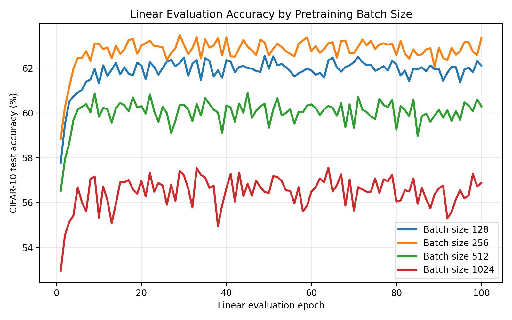
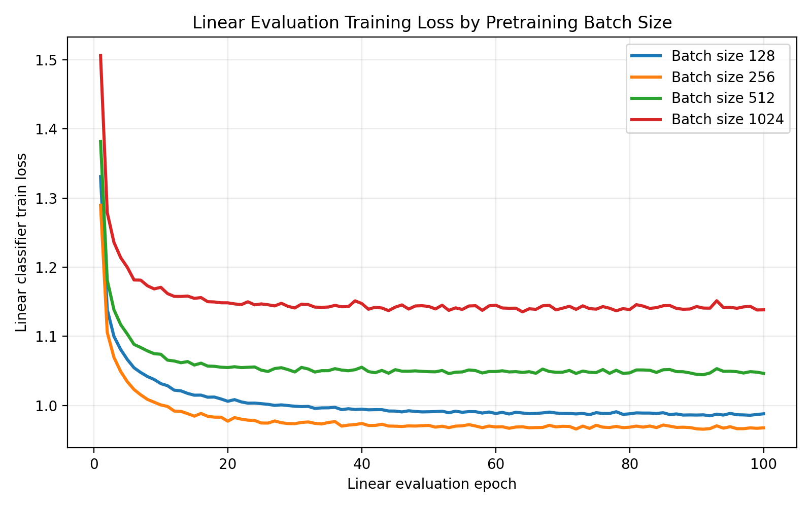
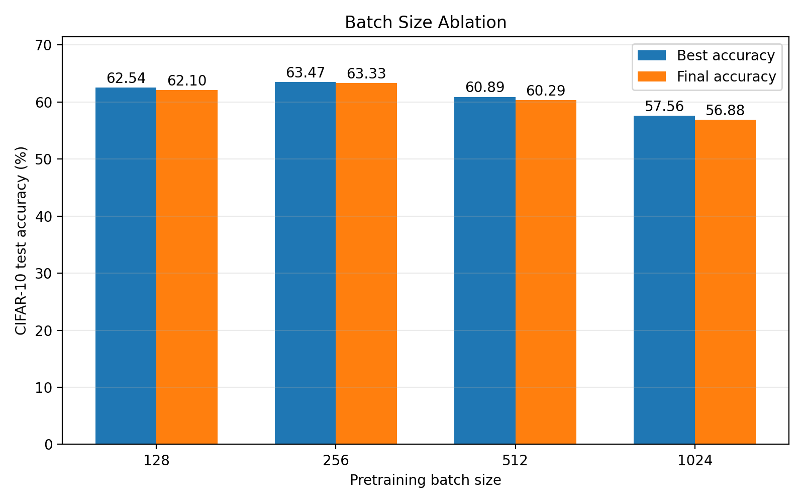
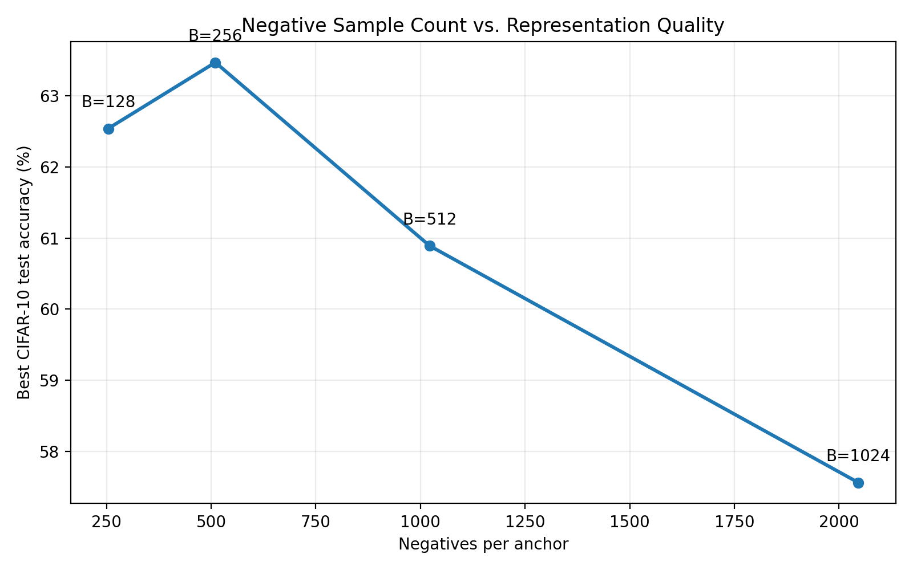

# Batch Size Ablation

## Result Table

| Batch size | Negatives / anchor | Feature dim | Best acc (%) | Best epoch | Final acc (%) |
|---:|---:|---:|---:|---:|---:|
| 128 | 254 | 512 | 62.54 | 49 | 62.10 |
| 256 | 510 | 512 | 63.47 | 29 | 63.33 |
| 512 | 1022 | 512 | 60.89 | 45 | 60.29 |
| 1024 | 2046 | 512 | 57.56 | 64 | 56.88 |

## Figures

## Report-Ready Interpretation

In this ablation, the intended variable is the SimCLR pretraining batch size.
With 2 augmented views per image, each anchor compares against
`2 * batch_size - 2` negative samples. Larger batches therefore
increase the number of in-batch negatives used by the NT-Xent objective.

The best linear-evaluation result is obtained with batch size 256,
which provides 510 negatives per anchor and reaches 63.47%
best CIFAR-10 test accuracy.

Accuracy does not increase monotonically with batch size in this run, so the largest batch is not automatically the best setting.
Compared with the batch-size-256 baseline, the best setting changes best accuracy by 0.00 percentage points.

The linear-evaluation accuracy is the main metric for this ablation because it
measures the quality of the frozen encoder representation, while the contrastive
training loss only measures optimization of the pretext objective.
