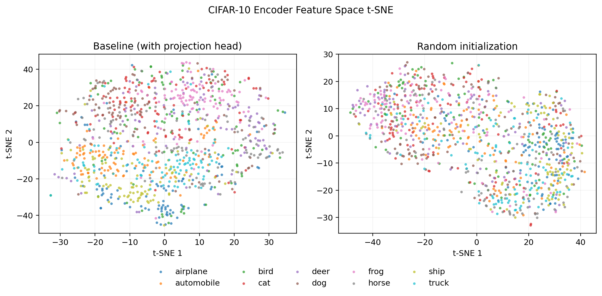

# Feature Space Visualization Analysis

## Setup

- Dataset: CIFAR-10 test split.
- Sample size for t-SNE: `1000` images.
- t-SNE perplexity: `30.0`.
- Random seed: `0`.

## Figures

## Report-Ready Interpretation

The t-SNE plots provide a qualitative view of the encoder feature space. If the
baseline SimCLR encoder forms more coherent same-class clusters than the random
encoder, this indicates that contrastive pretraining has learned semantic
structure beyond what is present in a randomly initialized ResNet.

The random initialization is an untrained control. It helps show whether visible
class structure is caused by learned representations rather than only by the
architecture or CIFAR-10 input statistics.

## How To Use These Outputs

- Use `tsne_comparison.png` as the qualitative overview of class clustering.
- Use `tsne_coordinates.csv` only if you need to remake or customize the scatter plots.

Note: t-SNE is a qualitative visualization and its axes are not directly
meaningful. Use it to discuss relative cluster separation and class mixing, not
as a precise quantitative metric.
