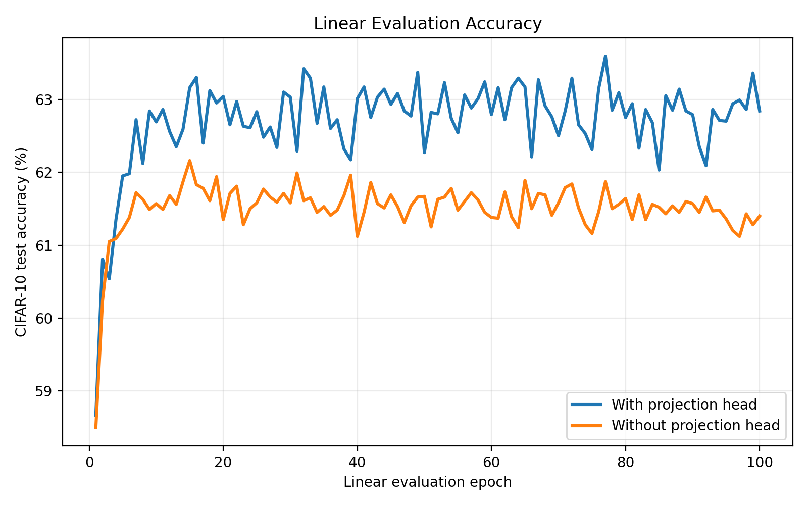
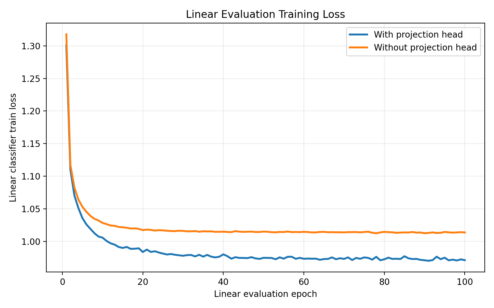
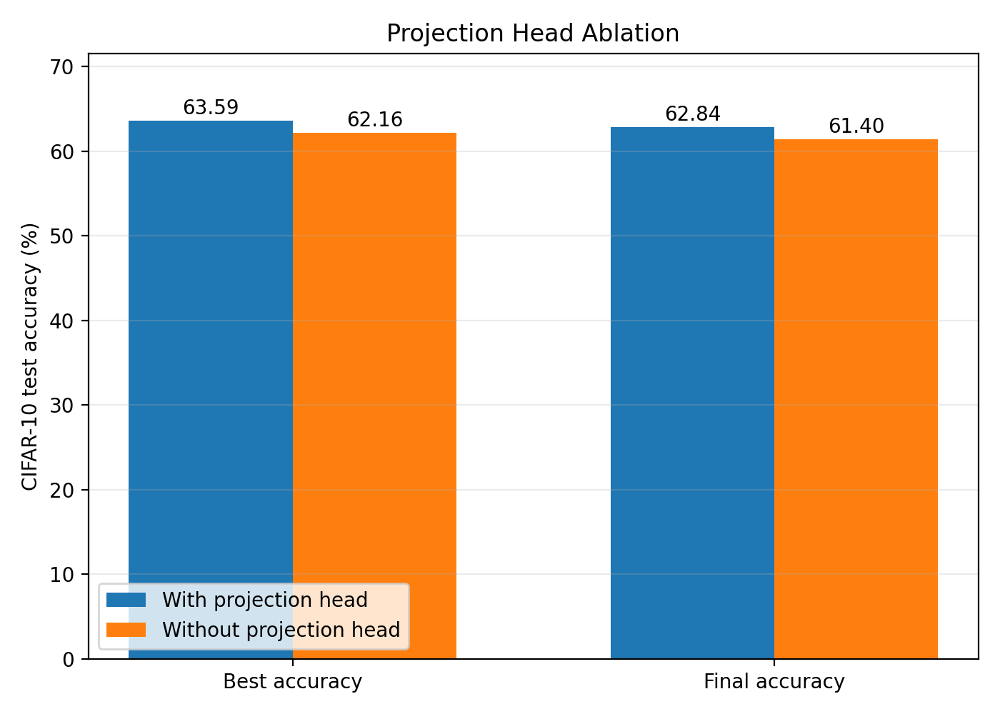

# Projection Head Ablation

## Result Table

| Setting | Feature dim | Best acc (%) | Best epoch | Final acc (%) |
|---|---:|---:|---:|---:|
| With projection head | 512 | 63.59 | 77 | 62.84 |
| Without projection head | 512 | 62.16 | 15 | 61.40 |

## Key Differences

- Best accuracy difference: 1.43 percentage points.
- Final accuracy difference: 1.44 percentage points.
- With projection head best epoch: 77.
- Without projection head best epoch: 15.

## Figures

## Report-Ready Interpretation

In this ablation, the only intended variable is whether the SimCLR model uses
the nonlinear projection head during contrastive pretraining. After pretraining,
the encoder is frozen and evaluated with the same linear classifier protocol on
CIFAR-10.

The model trained with a nonlinear projection head achieves higher linear-evaluation accuracy, suggesting that the projection head helps the encoder learn more transferable representations.

This supports the common SimCLR interpretation that the projection head separates
the contrastive objective space from the representation space used by downstream
tasks. The NT-Xent loss can shape the projected vector while preserving more
useful semantic information in the encoder output, which is what the linear
classifier evaluates.
